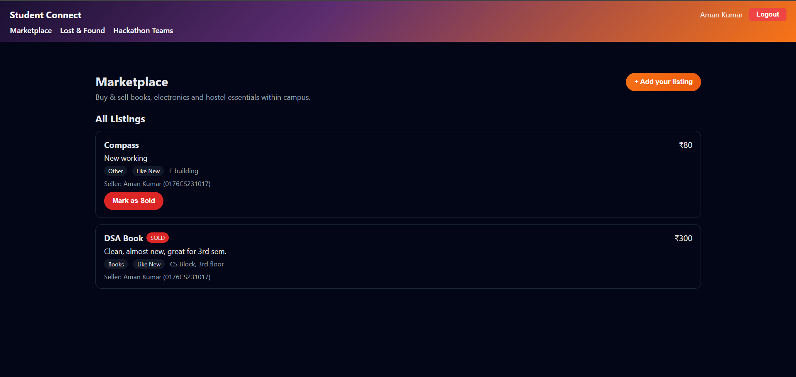
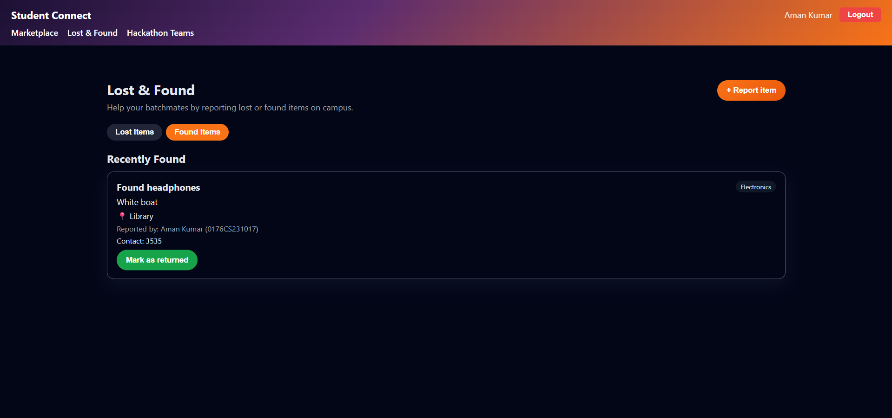
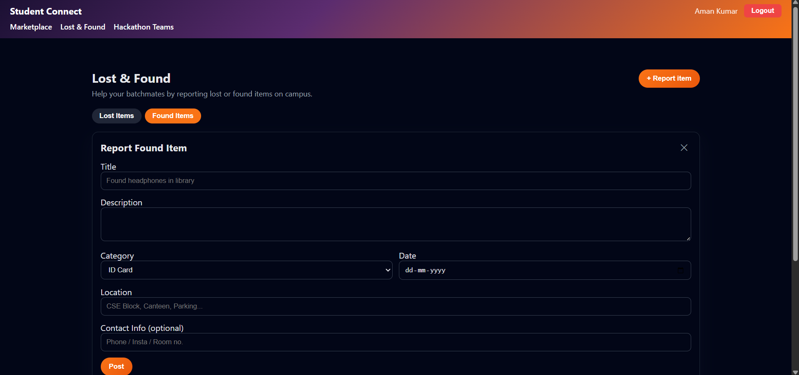
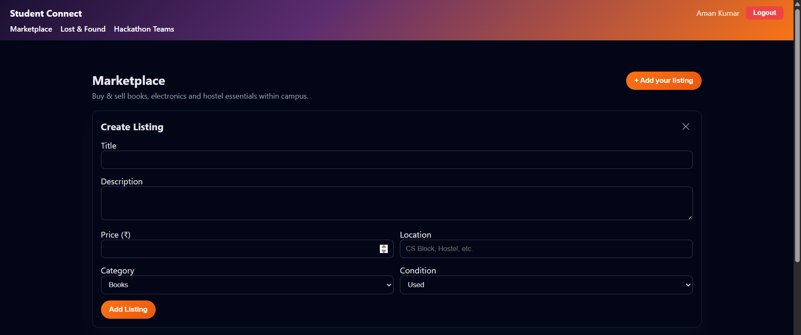
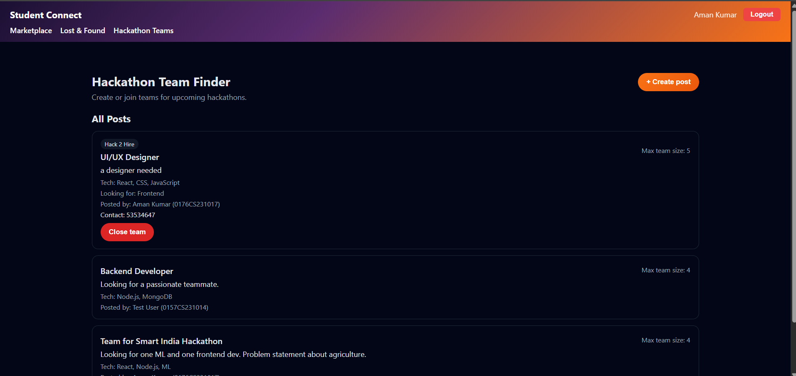
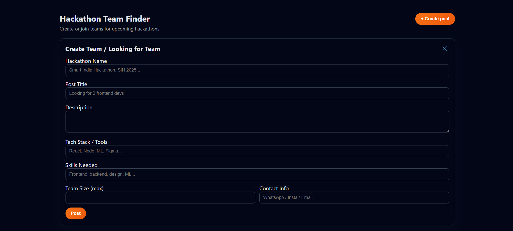
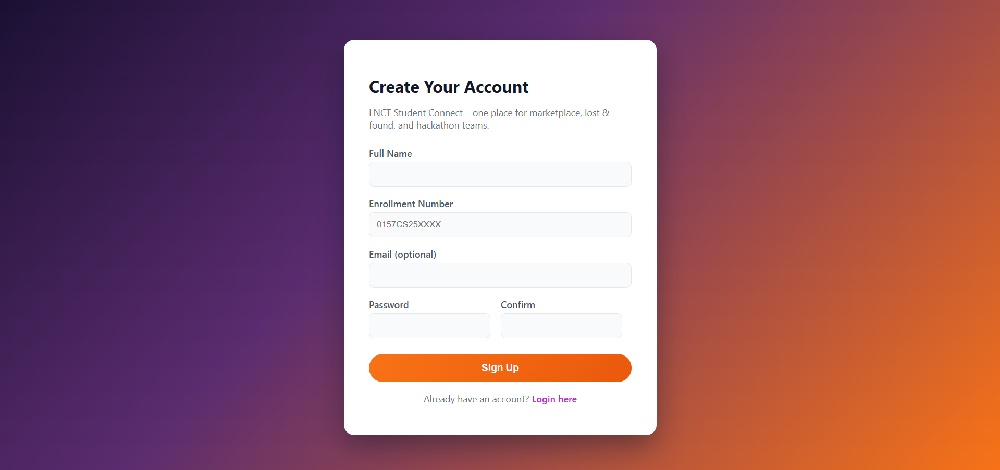

# 🎓 StudentConnect

**StudentConnect** is a full-stack campus utility platform built to streamline everyday student needs. It integrates multiple services into a single ecosystem, allowing students to **buy/sell items, recover lost belongings, and find hackathon teammates** efficiently.

The platform emphasizes **security, usability, and real-world practicality**, making it a scalable solution for campus communities.

---

## 🚀 Core Features

### 🛒 Marketplace
- Post items for sale with images, pricing, and descriptions  
- Browse listings within your campus  
- Simplified buying/selling experience  

### 🔍 Lost & Found
- Report lost items with detailed information  
- Post found items to help others  
- Improves recovery rate through centralized tracking  

### 🤝 Hackathon Team Finder
- Create or join teams based on required skills  
- Connect with like-minded peers  
- Encourages collaboration and innovation  

### 🔐 Authentication System
- Secure login/signup using **JWT authentication**  
- Protected routes and user-specific actions  
- Session handling for better security  

---

## 🛠️ Tech Stack

**Frontend**
- React.js  
- Responsive UI (modern CSS)

**Backend**
- Node.js  
- Express.js  

**Database**
- MongoDB  

**Authentication**
- JSON Web Tokens (JWT)

---

## 📸 Screenshots

### 🏠 Marketplace


### 🔍 Lost & Found Dashboard


### ➕ Add Lost/Found Item


### 📦 Add Marketplace Listing


### 🤝 Team Finder


### ➕ Add Team Requirement


### 🔐 Authentication (Sign In)


---

## ⚙️ Installation & Setup

### 1️⃣ Clone the repository
```bash
git clone https://github.com/your-username/studentconnect.git
cd studentconnect
